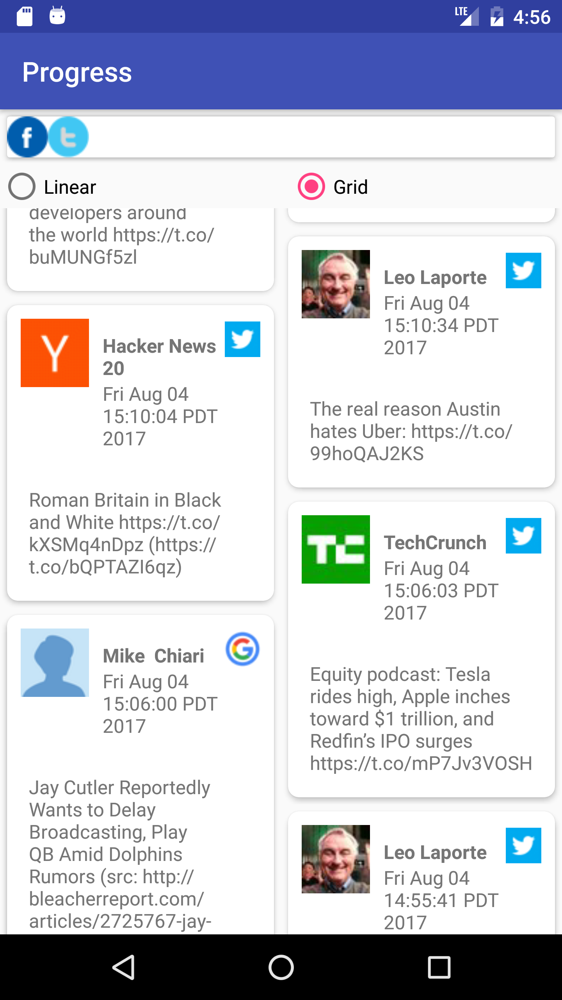

## PROGRESS
The purpose of this android application is to consolidate news, feeds, and statuses from various social network services into one application. Currently, the following will be retrieved:

  - Facebook news feeds(user_posts, login required)
  - Twitter statuses(home timeline, login required)
  - Google news(Retrieved by News API(https://newsapi.org/), no login required)

## Version: 0.4
What changed:

 - Add CardView to create better UI.
 - Handle Configuration Changes.
 - Add DB Contract class.

## Architecture and Technical Design
The application consists of two activities:

* LoginActivity: This is the main Activity, but just acts like a "place holder", simply enter any email address could proceed to next Activity. The email box will also retrieve user profile to autocomplete user emails.

    

* FeedActivty: Two Fragments will be attached to this Activity:
    * RecyclerViewFragment, which shows Feeds that are sorted in reverse chronological order(i.e latest first) within LinearLayout or StaggeredGridLayout

        ### Vertical

        
        

        ### Horizontal

        

        

    * DetailFragment, which shows detail of the feed when a user clicks the  item showed in RecyclerViewFragment.

        ### Vertical

        

        ### Horizontal

        

Two AsyncTask subclasses are created to download image and deal with API requests and responses.

* DownloadImageAsyncTask: which downloads images given url and set ImageView, an ImageCache is created to cache the images.
* DownloadDataAsyncTask: which, in parallel, sends requests to and gets responses from Fackbook Graph API, Twitter API and News Feed API(for Google News). An AtomInteger is used to do the synchronization. The feeds from different sources will be merged into one and showed in RecyclerViewFragment.

## Environment and Requirement
- SDK: 25
- IDE: Android Studio
- OS: Linux 4.4.0-79-generic
- Device: Emulator(Nexus 6)

## Doing/ToDo Logs
 * Configuration Changes Support: A couple of issues will occur when users rotate the device, one of which is that the activity will be destroyed and recreated while AsyncTask still has reference to the old activity.
    * Version 0.4: Handle configuration changes for Fragments and Activity.
 * Better User Interface: Mostly forcus on Application Logic at the moment and will make better UI in the future.
    * Version 0.2: RecyclerView has been used to replace ListView.
    * Version 0.3: Custom login buttons(for facebook and twitter) have been added.
    * Version 0.4: Add CardView.
 * Add Feeds or Post from more Social Network Servicess(e.g. LinkedIn).
 * Add support to store previous Feeds on devices.
    * Version 0.4: Add DB contract class for Feeds
 * Add Services and Notifications.

## Notes:

* I was intented to get facebook /{user_id}/home instead of /{user_id}/posts, however, the api(/{user_id}/home) has been unavailable since October 6th, 2015, because of user privacy. And /{user_id}/posts can only get posts from the user and post people make in his/her timeline).
